# Lecture 2: Word Vector

### Review

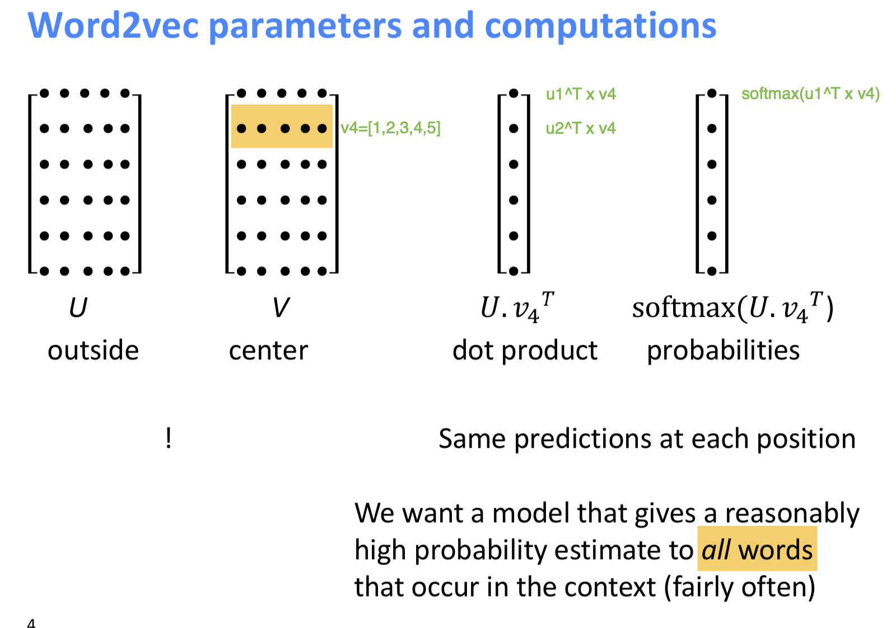

Suppose for one word i it has two vectors $v_i$ and $u_i$. When you use dot product between $U$ and $v_4$, it results in $[u_1v_4^T, u_2v_4^T, \cdots, u_Nv_4^T]$. Then after you apply softmax function, you could get:

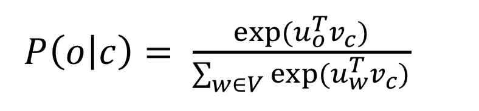 

### How to train parameters:

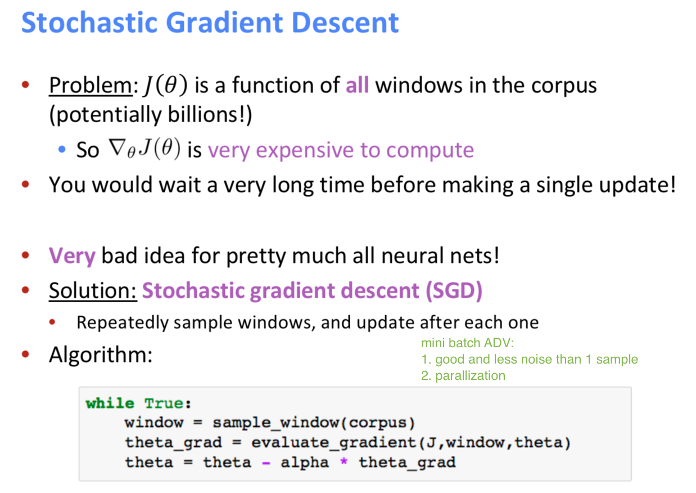

In this setting, we assume there are two vectors for one word, but actually we could also use one vector for one word.

Currently there are two main models:

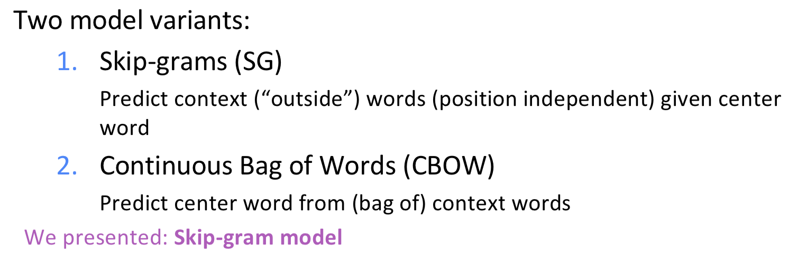

**The skip-gram model with negative sampling**

Replace all words set V with some negative samples (random words)

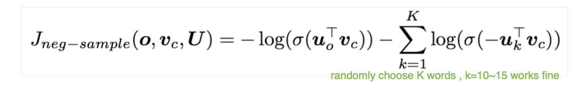

###  **co-occurrence counts** 

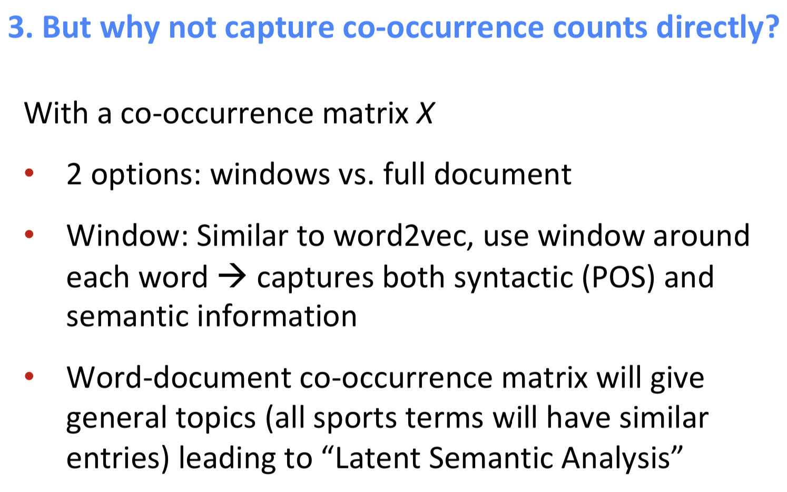

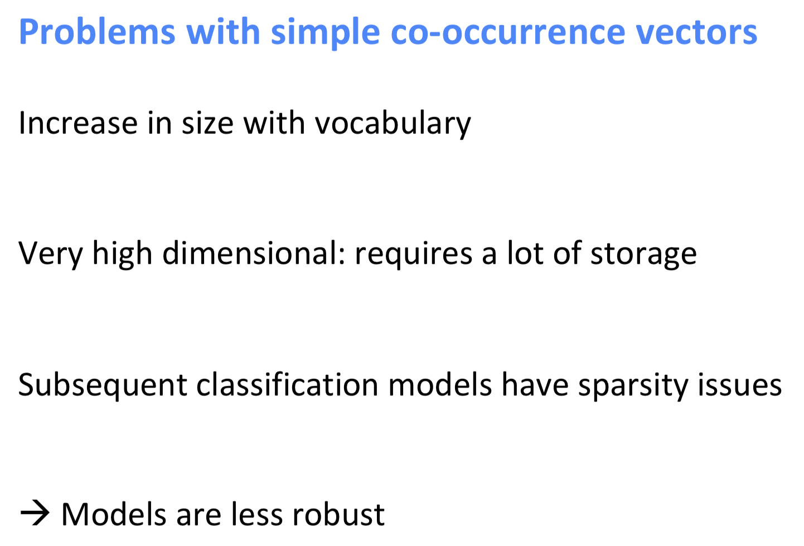

#### Solutions:**Low dimensional vectors**

**Methods1:** 

Dimensionality Reduction on X (HW1) -> Singular Value Decomposition of co-occurrence matrix *X*

**Tips:**  Scaling the counts in the cells can help **a lot**

1. Set some max/min limitations for words

2. Ramped windows that count closer words more

3. Use Pearson correlations instead of counts, then set

   negative values to 0

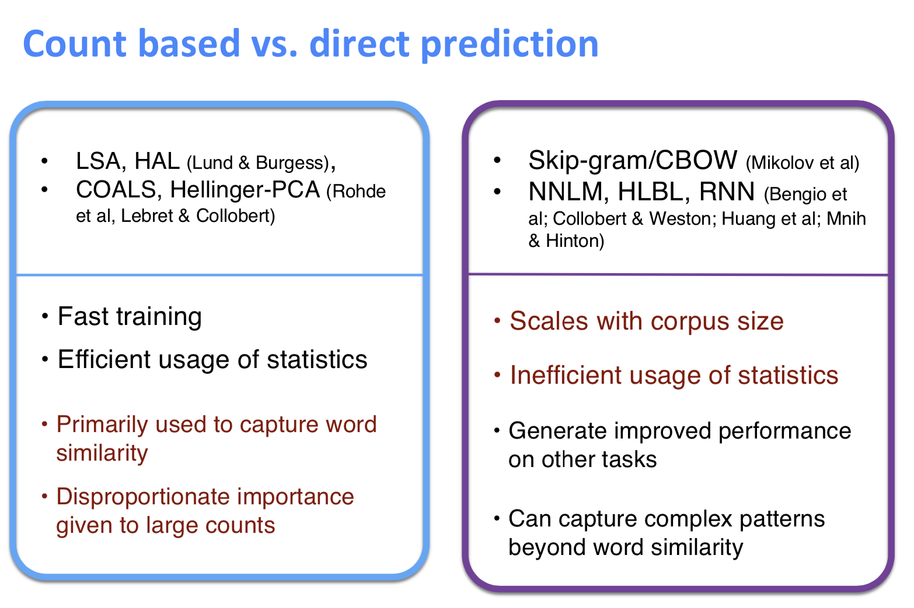

### Other Variations: GloVe  [2014]

Encoding meaning in vector differences

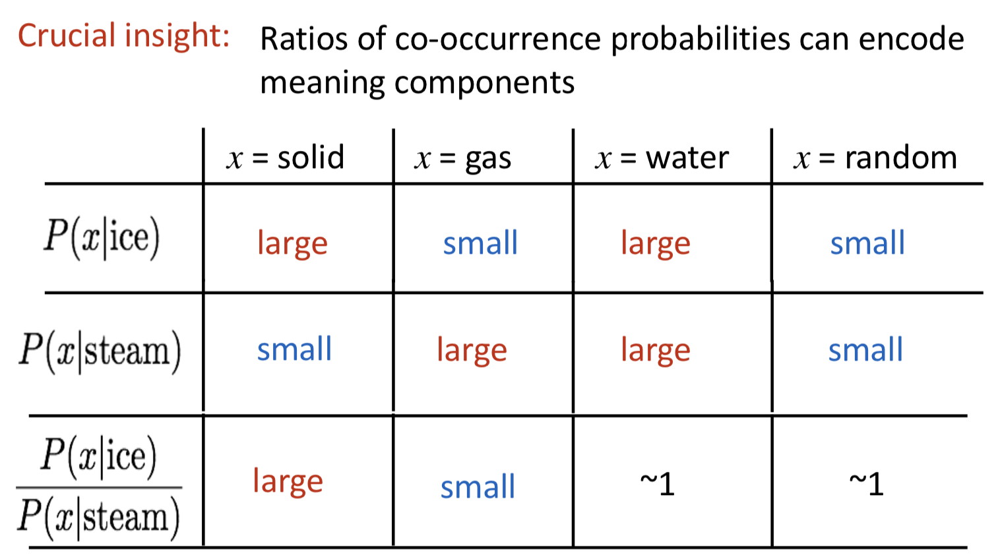

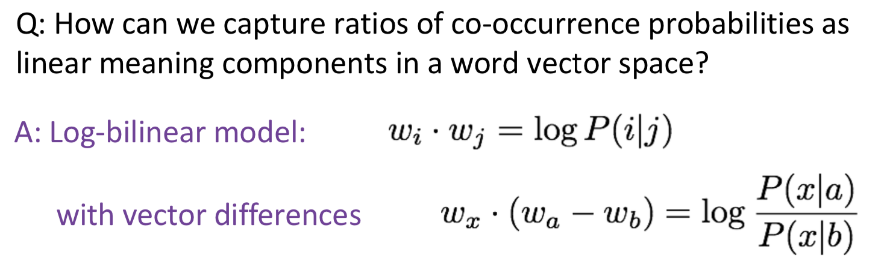

**Advs:**

* Fast training

* Scalable to huge corpora

* Good performance even with small corpus and small vectors

### **How to evaluate word vectors?**

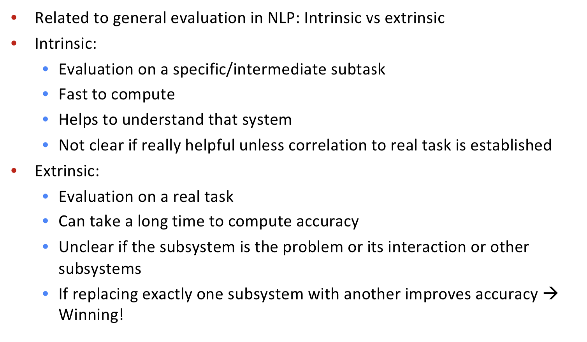

### CAP:

How to learning word embeddings:

1. Full document: LSA and etc.

2. Window size Information: CBOW (predict center word by words around) and Skip Gram (predict words around by center word)

3. GloVe considers two part above thus it could ignore those words whose co-occurence is 0 (which matrix factorization could not avoid) to reduce memory usage and calculation, and its learning method is similar to CBOW and Skip Gram which could be easily solved by optimization methods.

   

一点心得：

其实上第一节课的时候老师讲词向量的时候用了一个analogy的例子就让我很为之惊叹，其实只是一个很细微的差别。之前大多听的课老师举词向量的时候都会用这样类似的例子，比如“上海”和“中国”两个点连起来的线可能和“纽约”和“美国”连起来的线平行，表示他们比较类似，而这节课上manning举出的例子却有些不太一样（下图），他给出的这个例子是：king-man + woman -> queen. 虽然这个例子本质上和上面的通用例子很相似，但它感觉上更能揭示出词向量在表示semantic similarity上的优点，以及颇有些知识推理的味道在里面

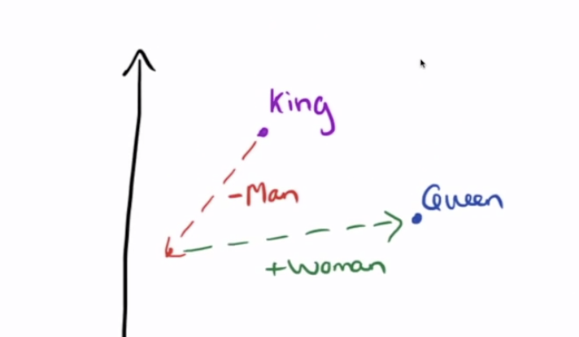

第二个感触很深的点在于写assignment1的时候，其中有一题是这样的：

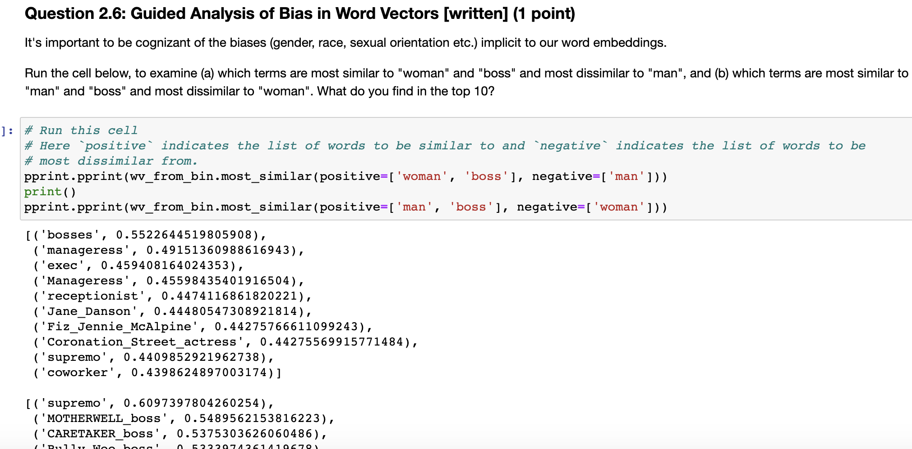

这是在我之前的课程、项目中从未被提及或者接触到的一点！考虑word embedding 会不会存在sexual racial or gender biases！这可能就是很不一样的 vision吧。。