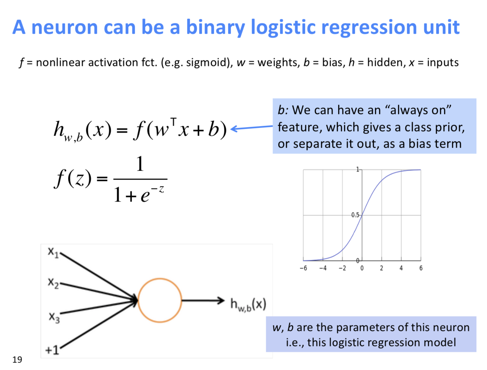
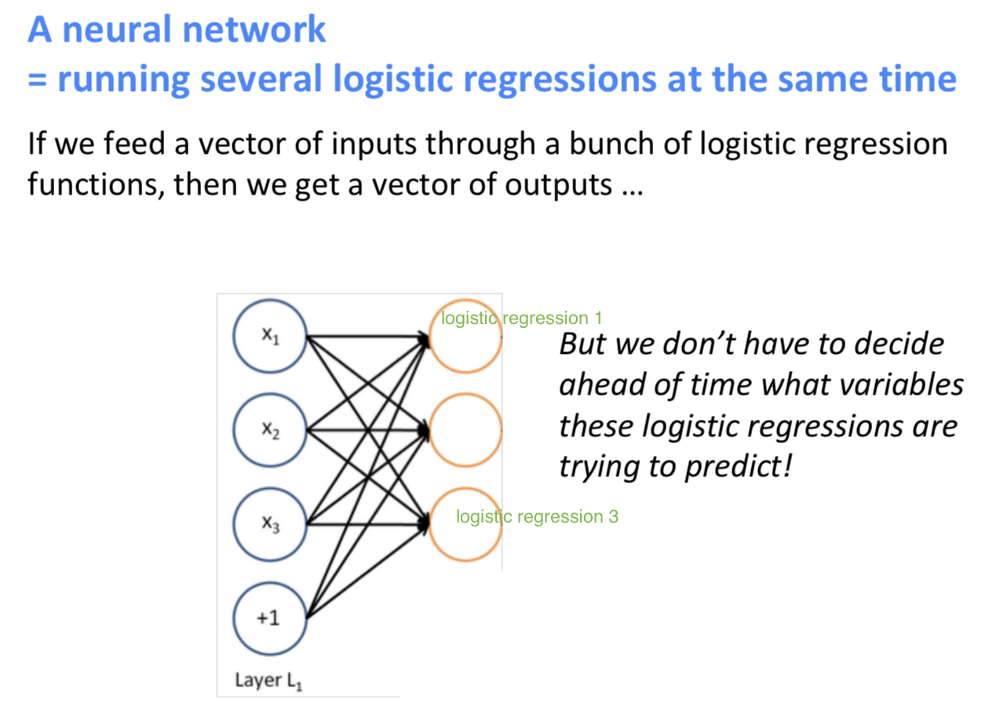
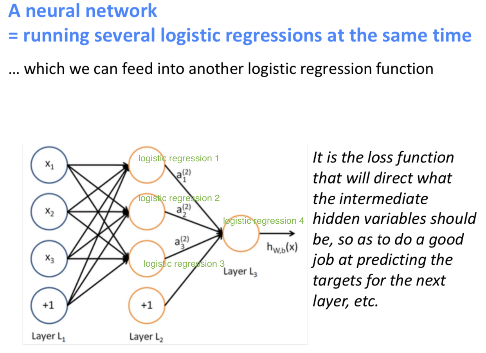

# Lecture 3: Neural Networks

### Pre-Review

Basic idea for classifier

Binary Classification:  Logistic Regression

Multi Classification: Softmax

However, they alone not very powerful and gives only linear decision boundaries  

### Neural Network Classifier

